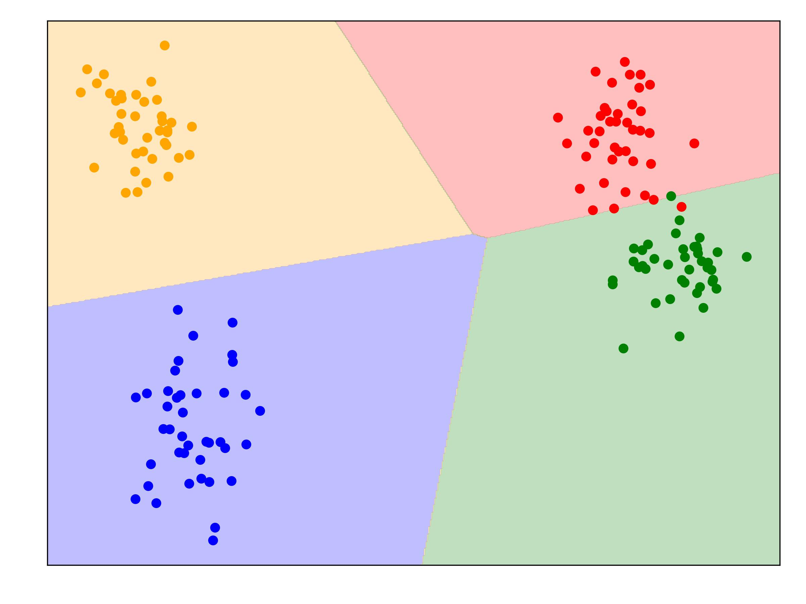
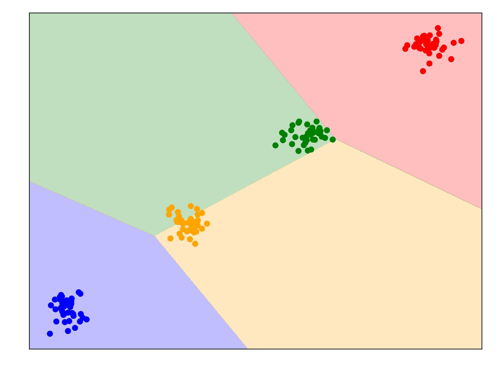
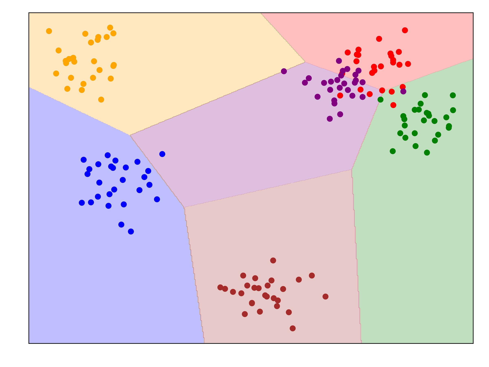
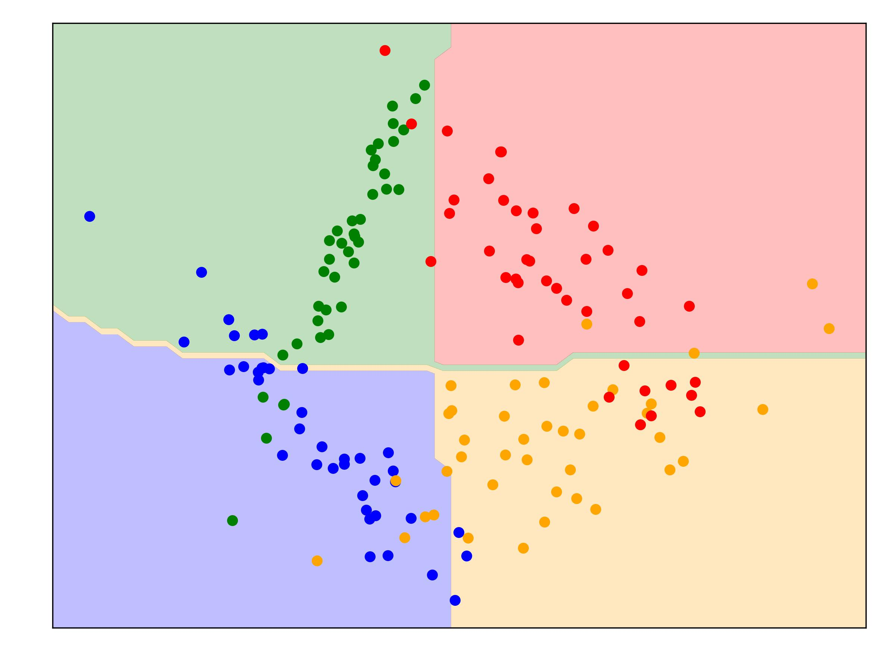

# HW 2. SVM.

В этом домашнем задании вам требуется написать свою модель SVM для решения задачи многоклассовой классификации. Для решения задания допускается использование библиотек `numpy`, `pandas` и `scipy`. Решение сдается коммитом в этот репозиторий заполненного файла `solution.py` и изображений `images/*`. За задание максимально можно набрать **30 баллов**. Вес каждого пункта задания указан в самом задании.

:exclamation: **Использование других библиотек приведет к завершению проверки со статусом `runtime error`, что соответствует 0 баллов за ДЗ. Для устранения этой ошибки достаточно перезалить решение с использованием только разрешенных библиотек.**

:exclamation: **После дедлайна ваши решения будут протестированы на плагиат и на факт использования ИИ. Штрафные санкции будут применяться в зависимости от степени плагиата и могут доходить до полного аннулирования ДЗ.**

:exclamation: **<span style="color:red"> Изменение каких либо файлов в этом репозитории кроме файлов `solution.py`, `images/*` и `README.md` приведет к статусу проверки `too many files modified`, что соответствует 0 баллов за ДЗ. Что с этим делать читайте [здесь](#problems). </span>**

После каждого изменения файла `solution.py` в этом репозитории будет запускаться автоматическая проверка. Вы так же можете запускать локальные проверки, если склонируете этот репозиторий к себе командой:
```
git clone https://github.com/mipt-ml-course/ml20248-HW2-SVM.git
cd ml20248-HW2-SVM
```
Команды запуска локальных проверок приведены ниже в описании заданий.

### Задание

#### Линейный SVM (15 баллов)
Реализуйте класс `BinaryEstimatorSVM` для обучения бинарного метода опорных векторов с помощью mini-batch градиентного спуска. Для этого реализуйте следующие функции и методы:
 * **(1 балл)** `predict` - метод для предсказания меток класса. Обратите внимание, что **свободный член прибавляется со знаком плюс**. Проверьте свое решение локально с помощью команды: `python run.py unittest binary_predict`.
 * **(2 балла)** `loss` - метод для подсчета функции ошибки. Проверьте свое решение локально с помощью команды: `python run.py unittest binary_loss`. Обратите внимание, что агрегация значения лосса по батчу производится усреднением.
 * **(2 балла)** `loss_grad` - метод для подсчета градиента функции ошибки для метода опорных векторов. Проверьте свое решение локально с помощью команды: `python run.py unittest loss_grad`.
 * **(1 балл)** `step` - метод шага обновления параметров модели **методом градиентного спуска**. Проверьте свое решение локально с помощью команды: `python run.py unittest binary_step`.
 * **(4 балла)** `fit` - метод для обучения весов модели методом mini-batch c помощью 
градиентного спуска. Проверьте свое решение локально с помощью команды: `python run.py unittest binlinear_svm`.

Реализуйте класс `LinearPrimalSVM` для обучения многоклассового метода опорных векторов с помощью стратегии one vs rest на бинарных моделях класса `BinaryEstimatorSVM`. Для этого реализуйте следующие функции и методы:
 * **(1 балл)** `one_vs_rest` - функция преобразует целевые метки в матрицу, где метки целевого класса принимают значение 1, а остальные метки — значение -1. Проверьте свое решение локально с помощью команды: `python run.py unittest one_vs_rest`.
 * **(2 балла)** `predict` - метод для предсказания меток класса. Проверьте свое решение локально с помощью команды: `python run.py unittest linear_predict_svm`. 
 * **(2 балла)** `fit` - метод для обучения многоклассовой модели с использованием `BinaryEstimatorSVM`. Проверьте свое решение локально с помощью команды: `python run.py unittest linear_svm`. В этом тесте производится обучение вашей модели на трёх различных датасетах. Проверка правильности вашей реализации производится автоматически через метрику accuracy, которая будет провалидирована вручную после дедлайна по визуализации разделяющих кривых. Разделяющие кривые будут автоматически сгенерированы и сохранены в папку [images/](images/) в процессе тестирования. Они также будут отображены в раделе [**Загрузка решения**](#linear). **САМОСТОЯТЕЛЬНО ГРАФИКИ СТРОИТЬ НЕ НУЖНО!**. 
      
#### Нелинейный SVM (15 баллов)
Реализовать **NonlinearDualSVM** - метод решения **много-классового нелинейного метода опорных векторов двойственной задаче  оптимизации с квадратичной регуляризацией с поддежкой любого нелинейного ядра**. Алгоритм решения SVM через двойственную задачу можно взять из ноутбука, который мы рассматривали в классе - вам нужно поддержать многоклассовое решение задачи и поддержку ядра для решений в нелинейном случае.

##### Подсказки
Получить получить ядерную матрицу Грамма можно так:

```python
# X shape is (N, dim)
# y_hat shape is (N, 1)

def kernel(x1, x2):
    return np.dot(x1, x2)

kernalized_X = np.apply_along_axis(lambda x1 : np.apply_along_axis(lambda x2: kernel(x1, x2), 1, X), 1, X)  
gram_matrix_Xy = kernalized_X * np.matmul(y_hat, y_hat.T)
```

Отделить опорные вектора от неопорных можно следующим образом:
```python
(self.alpha > epsilon) & (self.alpha <= self.C + epsilon)
```

Для обучения много-классового алгоритма воспользоваться схемой **one-vs-one**.
Реализуйте класс `SoftMarginSVM` для решения нелинейной двойственной задачи метода опорных векторов с помощью метода SLSQP из scipy. Для этого реализуйте следующие функции и методы:
 * **(1.5 баллов)** `kernel_linear`, `kernel_poly`, `kernel_rbf`  - функции ядер. Проверьте свое решение локально с помощью команды: `python run.py unittest kernels`.
 * **(1 балла)** `lagrange`, `lagrange_derive` - функции для подсчета функции Лагранжа для метода опорных векторов и её производной. Проверьте свое решение локально с помощью команды: `python run.py unittest lagrange`.
 * **(2.5 балла)** `predict` - метод для предсказания меток класса. Проверьте свое решение локально с помощью команды: `python run.py unittest binary_nonlinear_predict`.
 * **(5 балла)** `fit` - метод для обучения бинарной модели метода опорных векторов с помощью SLSQP из scipy. Проверьте свое решение локально с помощью команды: `python run.py unittest binnonlinear_svm`.
   
Реализуйте класс `NonLinearDualSVM` для обучения многоклассового метода опорных векторов с помощью стратегии one vs one на бинарных моделях класса `SoftMarginSVM`. Для этого реализуйте следующие функции и методы:
 * **(1 баллов)** `one_vs_one` - фунция, которая преобразует целевые метки в матрицу, где метки первого класса принимают значение 1, а метки второго — значение -1. Проверьте свое решение локально с помощью команды: `python run.py unittest one_vs_one`.
 * **(2 баллов)** `predict` - метод для предсказания меток класса. Проверьте свое решение локально с помощью команды: `python run.py unittest nonlinear_predict_svm`. 
 * **(2 балла)** `fit` - метод для обучения многоклассовой модели с использованием `SoftMarginSVM`. Проверьте свое решение локально с помощью команды: `python run.py unittest nonlinear_svm`. Аналогично тесту линейного классификатора будет сгенерирована [разделяющая поверхность](#nonlinear).
      
      
### Загрузка решения:

После локального тестирования решения, отправьте свое решение в ваш GitHub репозиторий с помощью команды ниже или с помощью интерфейса Github для загрузки файлов.

```
git add solution.py images/*
git commit -m 'commit solution'
git push
```

После загрузки решения в репозиторий рядом с названием репозитория появится оранжевая точка, которая означает, что система начала проверку вашего решения. Когда желтая точка сменится зеленной галочкой, значит, что проверка окончена. Результаты проверки будут записаны в summary проверки. Файл summary можно найти согласно [туториалу](https://docs.google.com/presentation/d/15Ned2Ew684tzvRX__VhJ0okxcvZsuiJGgY1kzaPrYtI/edit?usp=sharing).


#### Разделяющие прямые построенного линейного классификатора <a name="linear"></a>

<p align="center">
  
</p>

#### Разделяющие кривые построенного нелинейного классификатора <a name="nonlinear"></a>

<p align="center">

</p>

### Проблемы с загрузкой: <a name="problems"></a>

Если после проверки решения у вас в таблице висит статус `too many files modified`, значит вы изменили файлы какие-то файлы кроме разрешенных. Вам следует найти и удалить коммит в которым вы изменили что-то лишнее. Для этого в своем репозитории на GitHub нажмите на кнопку `commits` в правом верхнем углу, найдите этот коммит и запомните его порядковый номер сверху. Локально на своем устройстве введите следующие команды, где вместо N напишите порядковый номер коммита, который нужно удалить:
```
git pull
git reset --hard HEAD~N
git push -f
```
В результате будет удалено N последних коммитов. Повторно произведите загрузку решения. Обратите внимание, что все файлы, включая `solution.py`, будут сброшены до состояния последнего неудаленного коммита. 

:exclamation: **НЕ ЗАБУДЬТЕ СОХРАНИТЬ СВОЕ РЕШЕНИЕ В ДРУГОЙ ПАПКЕ, ПРЕЖДЕ ЧЕМ УДАЛЯТЬ КОММИТЫ.**

По возникающим вопросам можно писать в телеграм [@dionysus143](https://t.me/dionysus143) или на почту krylov.as@phystech.edu.
